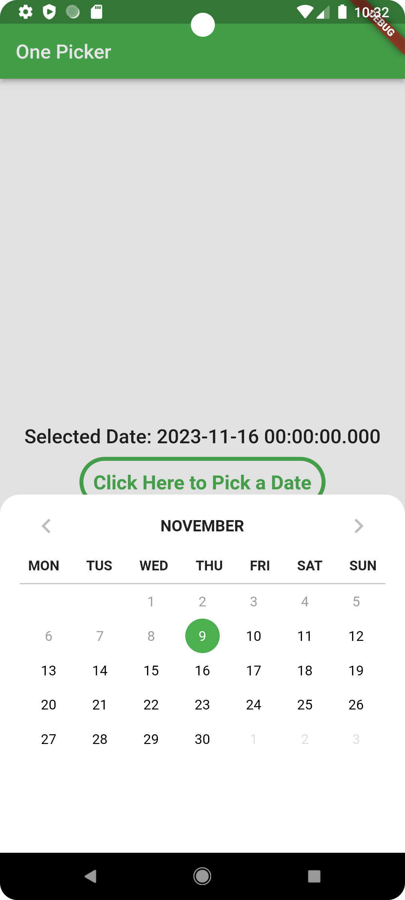

# onepicker

Access many data by using a one picker

## Features

- Date Picker


## Getting started

To use this package, add onepicker as a dependency in your pubspec.yaml file.

## Usage

- On pubspeck.yaml

```
onepicker: ^0.0.1
```

- On Dart Import

```
import 'package:onepicker/onepicker.dart';
```

- On implementation of Date Picker

```
OnePicker().date(
                    context,
                    selectedColor: Colors.green,
                    bgColor: Colors.white,
                    onTap: (value){
                      dateSeleted = value.toString();
                      setState(() {});
                    }
                );
```
<table>
  <tr>
    <td>Date Picker</td>
     <td>Date Range Picker</td>
     <td>Other Picker</td>
  </tr>
  <tr>
    <td></td>
    <td></td>
    <td></td>
  </tr>
 </table>

- See also from Developer

  - [Akurupela Applications](https://akurupela.com)

<p align="center">
      <a href="https://github.com/alexmojaki/futurecoder/blob/master/LICENSE.txt"></a>
      
      
      
</p>